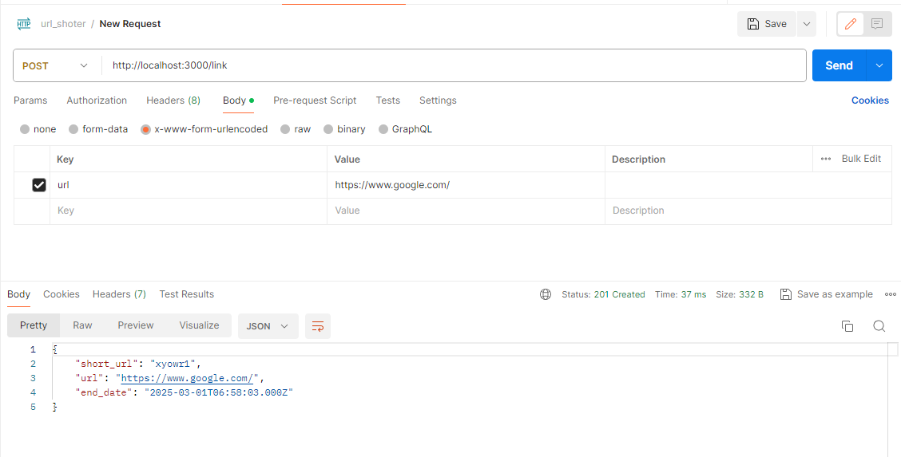
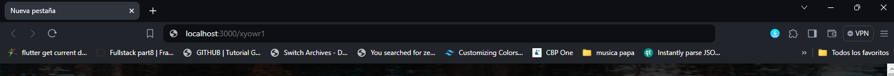
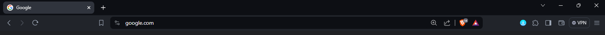

<p align="center">
  <a href="http://nestjs.com/" target="blank"></a>
</p>

# Implementation of a link shortener in Nest js:
This is a backend implementation of a simple link shortener created with Nest.js and Sequelize (with MySQL).

## How to Contribute
### **Introduction**
1.- To contribute, create a fork of the project.

2.- Clone the repository to your local machine:

```bash
git clone git@github.com:username/api_link_shortener.git
```

## How to start
Install all the project dependencies with:
```bash
yarn install
```

And start the development server with:
```bash
yarn start:dev
```

## Usage
#### *To create the short link:*

#### *Try the shortener in the browser locally.*

#### *This should redirect you to google.com,*
